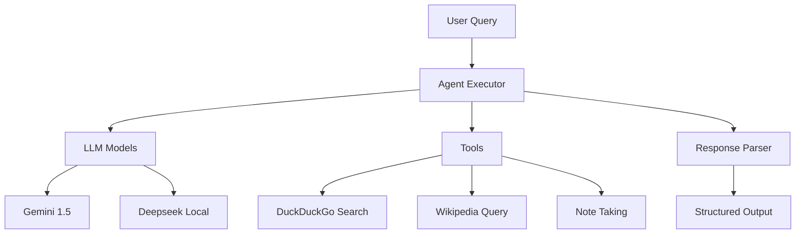

# AI Agent from Scratch

A powerful AI research assistant that combines multiple LLMs (Gemini and Deepseek) with various tools to perform research tasks, gather information, and save research notes.

## Description

This project implements an AI research agent using LangChain framework that can:
- Search the web using DuckDuckGo
- Query Wikipedia for information
- Take and save research notes
- Process queries using either Google's Gemini 1.5 or local Deepseek LLM
- Structure outputs using Pydantic models

## Features

- **LLM Support**: Choose between Google's Gemini 1.5
- **Multiple Research Tools**: 
  - DuckDuckGo web search
  - Wikipedia queries
  - Note-taking functionality
- **Structured Output**: Results are formatted using Pydantic models
- **Persistent Storage**: Research notes are saved with timestamps

## Project Structure

```
ai_agent_from_scratch/
├── main.py           # Main application logic
├── models.py         # Pydantic data models
├── tools.py          # Tool implementations (Search, Wikipedia, Notes)
├── constants.py      # Configuration and API keys
├── requirements.txt  # Project dependencies
├── .env             # Environment variables (not tracked)
└── notes/           # Directory for saved research notes
    └── research_output.txt
```

## System Architecture



## Dependencies

- langchain
- langchain-community
- langchain_google_genai
- langchain_ollama
- wikipedia
- duckduckgo-search
- python-dotenv
- pydantic

## Installation

1. Clone the repository:
```bash
git clone https://github.com/usman619/ai_agent_from_scratch
cd ai_agent_from_scratch
code .
```

2. Create and activate virtual environment:
```bash
python -m venv venv
source venv/bin/activate
```

3. Install dependencies:
```bash
pip install -r requirements.txt
```

4. Set up environment variables:
```bash
cp .env.example .env
# Add your Gemini API key to .env file
```

5. Run the main script:
```bash
python main.py
```

3. Enter your research query when prompted

## Environment Variables

```
GEMINI_API_KEY=your_api_key_here
```

## Example Output:
```bash
❯ python main.py
What can I help you with today?
 ❯ hammer head shark and save a note


> Entering new AgentExecutor chain...
```json
{
 "topic": "Hammerhead Shark",
 "summary": "Hammerhead sharks are a group of sharks characterized by their distinctive head shape, which is broad and flat, resembling a hammer.  This unique head shape is thought to improve their sensory perception, particularly their electroreception and vision.  There are several species of hammerhead sharks, varying in size and habitat.  They are found in tropical and subtropical waters around the world and are known for their ability to locate prey using their specialized sensory organs.",
 "sources": [
  "https://en.wikipedia.org/wiki/Hammerhead_shark"
 ],
 "tools": [
  "wikipedia",
  "note"
 ]
}
```

> Finished chain.
topic='Hammerhead Shark' summary='Hammerhead sharks are a group of sharks characterized by their distinctive head shape, which is broad and flat, resembling a hammer.  This unique head shape is thought to improve their sensory perception, particularly their electroreception and vision.  There are several species of hammerhead sharks, varying in size and habitat.  They are found in tropical and subtropical waters around the world and are known for their ability to locate prey using their specialized sensory organs.' sources=['https://en.wikipedia.org/wiki/Hammerhead_shark'] tools=['wikipedia', 'note']
```